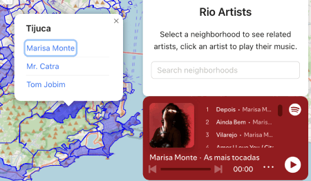

# Rio de Janeiro Music Map

An interactive map showcasing the musical heritage of Rio de Janeiro's neighborhoods, featuring famous artists from each area.

🔗 **[Access the app here](https://rio-artists.vercel.app/)**

## Features

- Interactive map of Rio de Janeiro neighborhoods
- Visual representation of artist density per neighborhood
- Clickable neighborhoods with artist information
- Spotify player integration for selected artists
- Search functionality for neighborhoods
- Hover effects to highlight neighborhoods

## Tech Stack

- React
- TypeScript
- Leaflet for map visualization
- Ant Design for UI components
- Spotify Embed API

## Components

### MapDisplay
- Renders the interactive map using Leaflet
- Displays neighborhood polygons with varying opacity based on artist count
- Shows tooltips and popups with artist information
- Handles neighborhood highlighting and selection

### SpotifyPlayer
- Embeds Spotify player for selected artists
- Positioned as a floating widget in the bottom right corner
- Responsive design with fixed dimensions

### Data Structure
- Neighborhood data stored in GeoJSON format
- Artist data organized by neighborhood
- Each artist entry includes name and Spotify ID

## Usage

1. Browse the map to explore Rio's neighborhoods
2. Hover over neighborhoods to see their names
3. Click on neighborhoods to view associated artists
4. Click on an artist's name to open their Spotify player
5. Use the search bar to find specific neighborhoods

## Data Sources

- Neighborhood boundaries from Data.Rio
- Artist information generated using AI and manually verified
- Spotify API integration for fetching artist IDs and music playback
- Custom script for automated Spotify artist ID retrieval using their API
